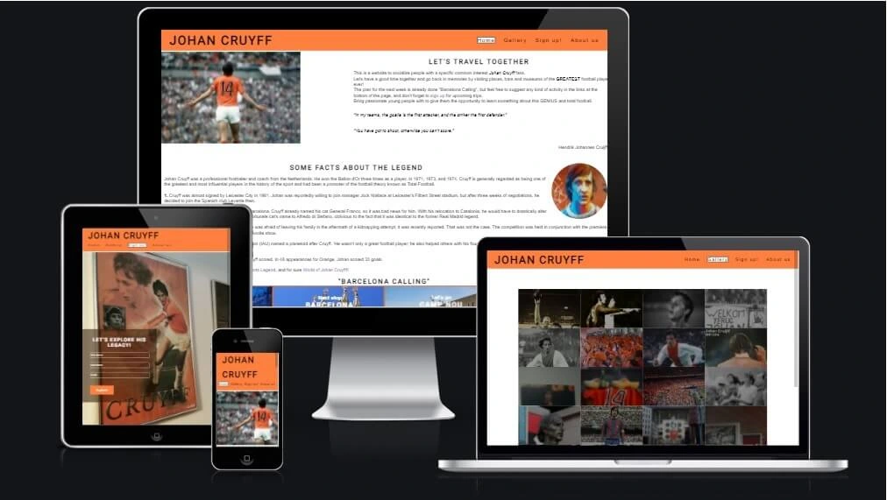
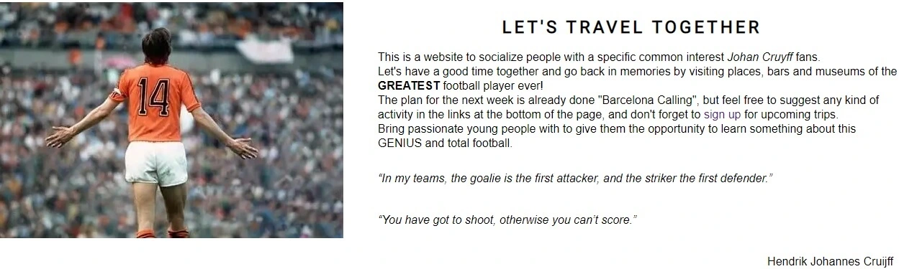
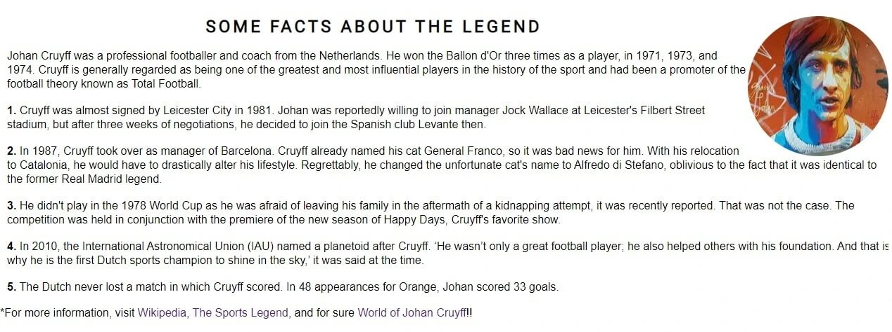
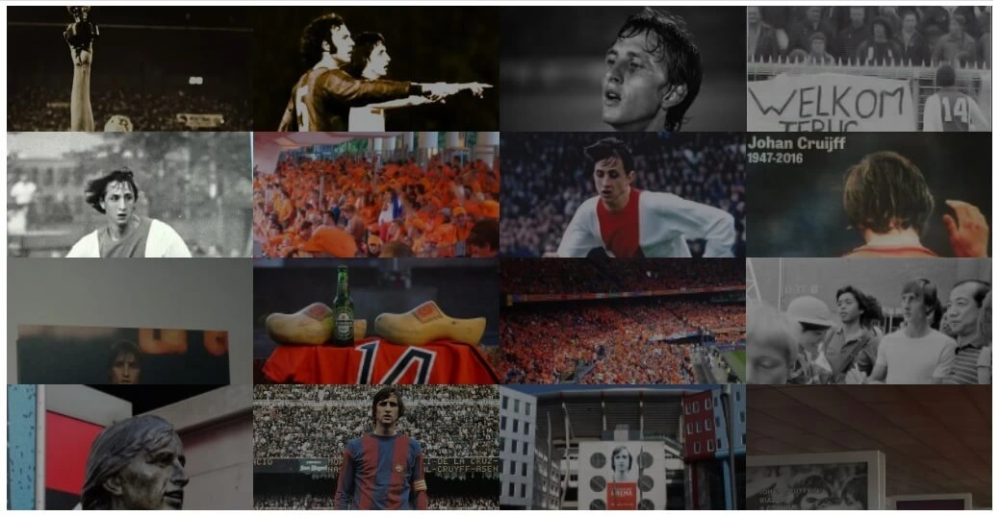
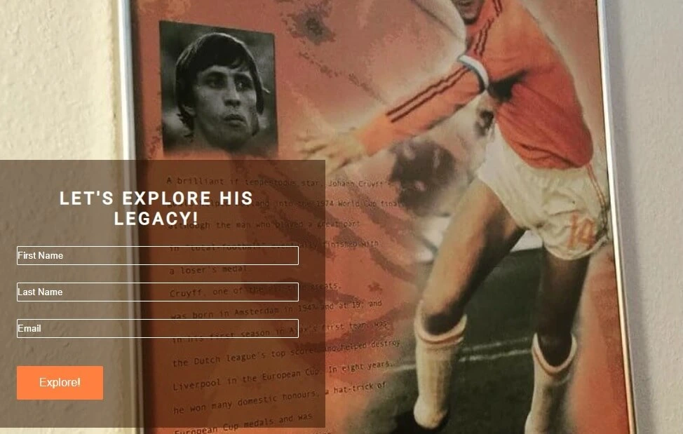

<h1 align="center">The flying Dutchman</h1>

[View the live project here.](https://xhorxh.github.io/HTML-and-CSS/index.html)

The Flying Dutchman is a site created to hopefully bring together all Johan Cruyff's fans and explore his legacy in different locations. With the help of suggestions from users, this site will be updated every month for upcoming trips. It is designed to be responsive and accessible on a range of devices, making it easy to navigate for potential elderly users and others.

<h2 align="center"></h2>

## Features

 __Navigation Bar__
  - Featured on all four pages, the full responsive navigation bar includes links to the Logo on the right side, Home page, Gallery, Sign Up and About Us page and is identical on each page to allow easy navigation.
  - The relevant navigation link is highlighted depending on the section of the page a user is on, meaning a potential elderly user is never confused as to which page they are on.   

__Main Section__
  - This section includes an iconic photo of Johan and gives some general information to directly understand the main purpose of this website. 
  - The two quotes from this football player are chosen to give the user the first impression of how these trips are organized and to encourage him interacting with suggestions and participation.

__Facts Section__
  - The facts section will allow the user to have a piece of general information about Cruyff and five facts about him, which are not widely known. 
  - At the bottom of this section are some links for more detailed information about this player.The links will open to a new tab to allow easy navigation for the user. 
   

__Trip section__
  - This section will allow the user to see exactly when the next trip will happen, and how it is organized. 
  - This section will be updated every month with different trips. 
  

  __The Footer__ 
  - The footer section includes links to the relevant social media sites for Cruyff. The links will open to a new tab to allow easy navigation for the user. 
  - The footer is valuable to the user as it encourages them to keep connected via social media and give their suggestions for upcoming trips. 
  

__Gallery__
  - The gallery will provide the user with historical images of the greatest football player ever.
  - This section is valuable to the user as they will be able to bring back memories.
  

  __The Sign Up Page__
  - This page will allow the user to get signed up for the next trip. 
  - The user will be asked to submit their full name and email address.
  

  ## Testing 
I tested my website all the time while I was writing it(using developer tools in Chrome to see how the elements are placed and with the help of the lessons, I managed to put everything where I wanted to). After adding media queries I had some little problems with the navigation bar and Gallery page. The navigation bar changed on devices with smaller screen resolution and it changed the order of the links, which was fixed by reducing letter-spacing and margin-right of the links. Fixing the Gallery page was a bit challenging because I used a lightbox to present the images and it was overlaying the footer. After some research of documentation, I had to change the heights of list elements for different size screens and that fixed the problem. The website is fully  responsive after lots of tests in [Responsinator](http://www.responsinator.com/?url=https://xhorxh.github.io/HTML-and-CSS/index.html), developer tools and other websites.

### Validator Testing 

- HTML
  - No errors were returned when passing through the official [W3C validator](https://validator.w3.org/nu/?doc=https%3A%2F%2Fxhorxh.github.io%2FHTML-and-CSS%2Findex.html)
- CSS
  - No errors were found when passing through the official [(Jigsaw) validator](https://jigsaw.w3.org/css-validator/validator?uri=https%3A%2F%2Fxhorxh.github.io%2FHTML-and-CSS%2Findex.html&profile=css3svg&usermedium=all&warning=1&vextwarning=&lang=en)

## Deployment

### GitHub Pages

The project was deployed to GitHub Pages using the following steps...

1. Log in to GitHub and locate the [GitHub Repository](https://github.com/Xhorxh/HTML-and-CSS)
2. At the top of the Repository (not top of page), locate the "Settings" Button on the menu.
3. Scroll down the Settings page until you locate the "GitHub Pages" Section.
4. Under "Source", click the dropdown called "None" and select "Master Branch".
5. The page will automatically refresh.
6. Scroll back down through the page to locate the now published site [link](https://xhorxh.github.io/HTML-and-CSS/index.html) in the "GitHub Pages" section.

## Credits

### Content

-   The information is from some sources like [Wikipedia](https://en.wikipedia.org/wiki/Main_Page),
[The sports legends](https://www.thesportslegends.com/) and [World of Johan Cruyff](https://www.worldofjohancruyff.com/).
-   In the third section of the main page, I was inspired by the Love running project, this code was copied and changed.
-   The lightbox gallery was created with the help of [CodePen](https://codepen.io/search/pens?q=lightbox+gallery)

### Media

-   All the images on this website are downloaded from [Flickr posts](https://www.flickr.com/)
and [Marca](https://www.marca.com/).

### Acknowledgements

-   My Mentor for continuous helpful feedback.

-   Tutor support at Code Institute for their support.

